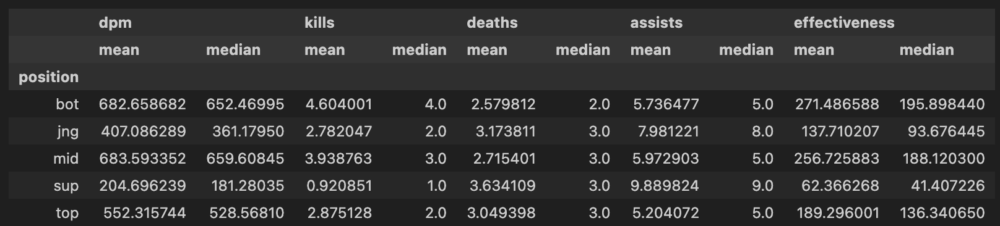

<html lang="en">
<body>
    

        <h1>League of Legends Analysis: Race to the Nexus</h1>
	<h3>by Santiago Cardenas Rey and Michael Luo</h3>
	<h5>Step 1: Description</h5>
        
We chose the league of legends dataset for this project because it provides a rich and dynamic set of variables that allow for meaningful hypothesis testing and predictive modeling. The dataset includes key performance metrics such as damage per minute, kills, assists, deaths, and game results which enable various statistical analyses. Unlike structured datasets like recipes or power outages, this dataset introduces human decision-making and variability, making the analysis more complex and engaging. Since I have an interest in gaming and data-driven insights, working with this dataset makes the project both enjoyable and intellectually stimulating. Fellow gamers may relate to what we are assessing to best determine the performance of players based on what kind of player they are or coe across (i.e. ADC bot or mid-lane player). League of Legends (LoL) is a highly competitive esport with a global fanbase, featuring professional teams battling across various leagues and tournaments. Each role within a team has a distinct responsibility, but two of the most crucial damage-dealing roles are ADC (Attack Damage Carry) and Mid Laner. These roles often dictate the outcome of fights and matches, making their performance a key aspect of a team's success.
One of the most important metrics in evaluating a player's impact is damage per minute per deaths + 1 (DPM / (Deaths + 1)), which adjusts raw damage output by factoring in survivability. This statistic can help determine which role exerts more influence in professional play.
Our central question is:
Which role—ADCs or Mid Laners—carries their team more often based on DPM / (Deaths + 1)?
By analyzing professional match data, we aim to uncover whether ADCs or Mid Laners consistently contribute more adjusted damage and assess how this impacts team success. Understanding this can provide insights into optimal team compositions, strategic drafting, and in-game decision-making.

	
 The dataset contains 97,980 rows after filtering out team summary data, focusing solely on individual player statistics. Below are the key columns relevant to our analysis:

</body>
	<ul>
	    <li>gameid:  A unique identifier for each match played.</li>
	    <li>position: The role played by an individual player within their team composition. The roles include top, jungle, mid, bot(ADC), and support.</li>
	    <li>dpm (Damage per Minute): The amount of damage a player deals per minute. This is the base metric we will use to evaluate player performance, which will later be adjusted using deaths.</li>
	    <li>kills: The number of enemy champions a player successfully eliminated during the match.</li>
	    <li>deaths: The number of times a player was eliminated by enemy champions.</li>
	    <li>assists: The number of assists credited to a player, indicating instances where they contributed to eliminating an enemy champion without securing the kill themselves.</li>
	    <li>result: This column indicates the outcome of a match for a specific player's team. 1 represents a win, while 0 represents a loss.</li>
	    <li>league: The specific league tournament in which the match took place.</li>
		<li>effectiveness: Column created calculated using damage per minute / (deaths + 1)
<body>
    

        <h5>Step 2: Data Cleaning and Exploratory Data Analysis</h5>
        <h3>Data Cleaning</h3>
        
We first only keep the relevant columns: <code>gameid</code>, <code>position</code>, <code>dpm</code>, <code>kills</code>, <code>deaths</code>, <code>assists</code>, <code>result</code>, <code>league</code>. In this dataset, each game has 12 rows, with 10 rows representing each of the players and 2 rows for summarizing the overall team performance and result (i.e. team summary rows). We removed the 2 rows for each game that summarized the overall team performance, which brought the initial number of rows from 117,576 to 97,980. We then dropped all the rows that had missing values and found out that it was the same as without dropping, so our data doesn't have any rows with missing data.

		
Below is the head of our league_clean dataframe.

		
		
        
We performed univariate analysis on the distribution of DPM, which is almost normal with a slight right skew. This shows that the data is well-behaved, where most players deal moderate damage, while fewer achieve very high DPM, which is typical of gaming scenarios. The box plot above the histogram shows several outliers on the right-hand side. These represent exceptionally high DPM performances, likely from players who dominated the game or played specific high-damage champions.

		
		
The box plot represents a bivariate analysis of effectiveness (DPM / (Deaths + 1)) across different roles in League of Legends, allowing us to compare how different positions contribute to sustained damage while accounting for deaths. This analysis highlights clear trends: bot lane (ADC) and mid lane exhibit the highest median effectiveness, suggesting that these roles tend to have the most impact in terms of damage output. The jungle and support roles generally have lower effectiveness, with supports showing the lowest median and least spread, aligning with their more utility-focused playstyle. The presence of extreme outliers, especially in ADC and mid, suggests that performance in these roles can vary significantly, possibly influenced by champion picks, game state, or player skill.

		
		
We first grouped the cleaned dataset by position and then calculated the mean and median of all key statistics. By comparing player performance across different roles, we gained a clearer understanding of how each position contributes to the game. Mid and Bot lane players have the highest DPM and effectiveness scores, reinforcing their roles as primary damage dealers. Support players have the lowest DPM and kills but lead in assists, highlighting their role in enabling teammates. Jungle players balance kills and assists, as they frequently roam to support other lanes. Top lane maintains moderate stats across all metrics, indicating a mix of durability and damage potential. This grouping helped visualize the distinct impact each position has on overall gameplay.

    

</body>
	

		<h5>Step 3: Assessment of Missingness</h5>
	

	

		
<b>playername</b>: MD (Missing by Design)

		<ul>
			<li><b>playername</b> is missing by design since you can take a look at the <b>position</b> column and if you see the value "team" then you can predict with certainty that the <b>playername</b> value is going to be null.</li>
		</ul>
	

	

		
<b>playerid</b>: MD (Missing by Design)

		<ul>
			<li><b>playerid</b> is missing by design since you can take a look at the <b>playername</b> column and if you see a null value then you can predict with certainty that the <b>playerid</b> value is going to be null.</li>
		</ul>
	

	

		
We conclude our assessment of missingness analysis by stating that <b>among our relevant columns</b> we found no column that has null values, therefore it is impossible to find any columns that are <b>NMAR</b> and/or <b>MAR</b>.

	

	

		<h5>Step 4: Hypothesis Testing</h5>
	
	
	

		<h6><b>Null Hypothesis</b><h6>
	

	

		
The mean carry potential (measured as Damage Per Minute / (Deaths + 1)) is the same for mid-lane and ADC (bot-lane) players.

	

	

		<h6><b>Alternative Hypothesis</b></h6>
	

	

		
The mean carry potential is higher for mid-lane players than for ADC players.

	

	

		<h6><b>Test Statistic</b><h6>
	

	

		
The test statistic will be the <u>observed difference</u> in means of carry potential between mid-lane and ADC players.

	

	

		<h6><b>Significance Level</b></h6>
	

	

		
The significance level will be <b>0.05</b> as we understand there can be some variation among both types but for the null hypothesis, there should be a clear difference.

	

	

		<h6><b>p-value</b></h6>
		<u><i>1.0</u></i>
	

	

		<h6><b>Results</b></h6>
		<u><i>To perform the permutation test, we first calculated the observed difference in mean carry potential (effectiveness) between mid-lane and ADC players. This provided the baseline difference we aimed to test. Next, to simulate the null hypothesis, we randomly shuffled the effectiveness values across all players, ensuring that any inherent role-based differences were removed. We then reassigned these shuffled values to the mid-lane and ADC groups while maintaining their original sample sizes and recalculated the difference in means. This process was repeated 1000 times to generate a distribution of permuted differences under the assumption that there is no true difference between the roles. The p-value was computed as the proportion of these permuted differences that were greater than or equal to the observed difference.</u></i>
	

	

		<h6><b>Justifications</b></h6>
		
		<u><i>Based on the hypothesis test performed, with a p-value of 1.000, we fail to reject the null hypothesis. This suggests that the observed difference in carry potential is entirely consistent with what we would expect under random chance. The histogram shows that the observed difference in means (-14.761) lies well within the range of the permuted distribution, meaning there is no statistical evidence to suggest that mid-lane players have a higher mean carry potential than ADC players. This result implies that the differences in carry potential between these roles may be due to normal game variations rather than an inherent positional advantage.</u></i>
	

	

		<h5>Step 5: Framing a Prediction Problem</h5>
	

	

		
<b><u>Prediction Problem</u></b>: We want to identify the role of the player given their post-game data. This will imply for us to do a <u>classification model</u>
	
		
<b><u>Type of Classification</b></u>: multiclass classification. Some columns have non-binary data but are yet numeric (some columns are binary too), thus a suitable task for a multiclass classification.

		
<b><u>Response Variable</b></u>: since we are figuring the position of the player with the given player's match statistics, the response variable is <b><u>position</u></b>.

		
<b><u>Motivation</b></u>: The motivation behind this is to identify the patterns, statistics, strengths, weaknesses, and behaviors of distinct player positions. By using match performance statistics, we can inform people as to how different kind of players behave in the match (i.e. suppose a player is type 1, then we would be able to have a solid understanding of the player's skills and preferences such as firstblood count or damage per minute or even player location patterns). In here we are prioritizing previous match statistics and outcomes to predict future matches where the players have known positions (reverse causality).

	

	

		<h5>Step 6: Baseline Model</h5>
	

	

		
For the baseline model, we used a <b>Random Forest Classifier</b>, with the following six features: <b>kills, deaths, dpm_per_death, teamkills, monsterkills, and minionkills</b>.

    
All six features are <b>quantitative</b>:

    <table>
        <tr>
            <th>Features</th>
            <th>Type</th>
            <th>Encodings</th>
        </tr>
        <tr>
            <td>kills</td>
            <td>Numeric</td>
            <td><b>StandardScaler</b></td>
        </tr>
        <tr>
            <td>deaths</td>
            <td>Numeric</td>
            <td><b>StandardScaler</b></td>
        </tr>
        <tr>
            <td>dpm_per_death</td>
            <td>Numeric</td>
            <td><b>StandardScaler</b></td>
        </tr>
        <tr>
            <td>teamkills</td>
            <td>Numeric</td>
            <td><b>StandardScaler</b></td>
        </tr>
        <tr>
            <td>monsterkills</td>
            <td>Numeric</td>
            <td><b>StandardScaler</b></td>
        </tr>
        <tr>
            <td>minionkills</td>
            <td>Numeric</td>
            <td><b>StandardScaler</b></td>
        </tr>
    </table>
    
We applied the <b>StandardScaler Transformer</b> to normalize all numerical features. This step ensures that differences in game length do not disproportionately influence the model, as players in longer matches accumulate more statistics, making direct comparisons unfair.

	

</body>
